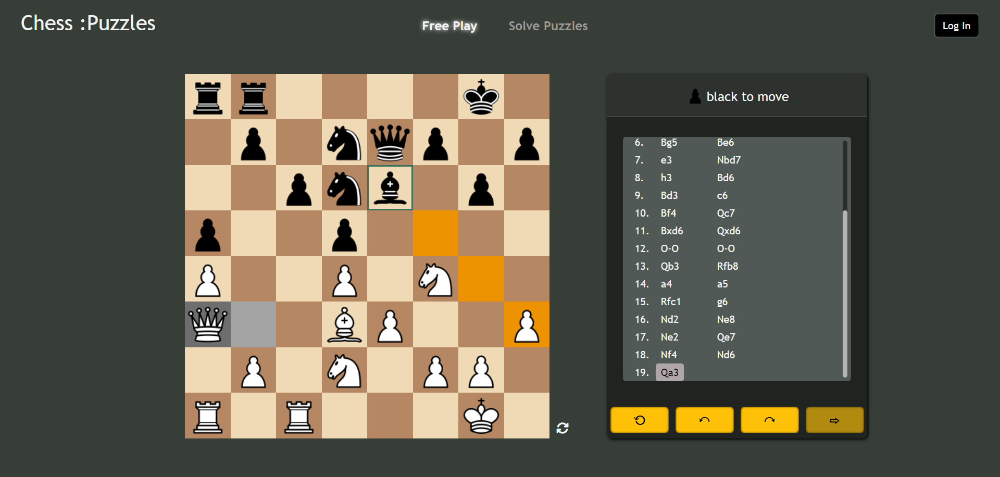
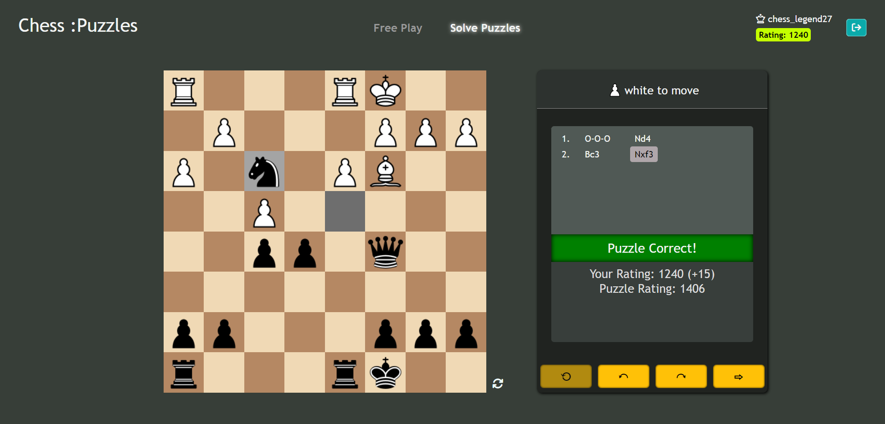

# Chess :Puzzles

Welcome to Chess :Puzzles! This full stack application allows chess enthusiasts to hone their tactics through diverse puzzles and challenge themselves to improve their rating.

*Free Play Mode*

*Puzzle Mode*

**Technologies used**: HTML, CSS, JavaScript, Bootstrap, NodeJS, Express, EJS, MongoDB

## Features

    
Interactive Chessboard

    <ul>   
        <li>Intuitive interface for moving pieces</li>
        <li>Move logging (using <a href="https://en.wikipedia.org/wiki/Algebraic_notation_(chess)">Standard Algebraic Notation</a>)</li>
        <li>Move history navigation</li>
    </ul>

    
Full Chess Logic

    <ul>
        <li>
            Move validation following chess rules, including:
            <ul>
                <li>Castling</li>
                <li>Promotion</li>
                <li>En passant</li>
                <li>Pinned pieces</li>
            </ul>
        </li>
        <li>Checks, Checkmates</li>
        <li>Turn management</li>
    </ul>

    
User Profiles

    <ul>
        <li>Secure authentication</li>
        <li>Dynamic rating system that allows players of all skill level to find a challenge</li>
    </ul>

## Getting Started

**Prerequisites**: NodeJS, MongoDB

First, clone the repository

    git clone https://github.com/bobetpopo/chess-puzzles-website.git

Then, install dependencies

    cd chess-puzzles-website
    npm install

To set up the puzzles on your machine:
1. Get the puzzles [here](https://database.lichess.org/#puzzles). 
2. Locally create the Mongo database `chessApp` and import the puzzles into a `puzzles` collection (the MongoDB Compass tool is great for this). 

Finally, run `node index.js` to start the server on **localhost:3000**

